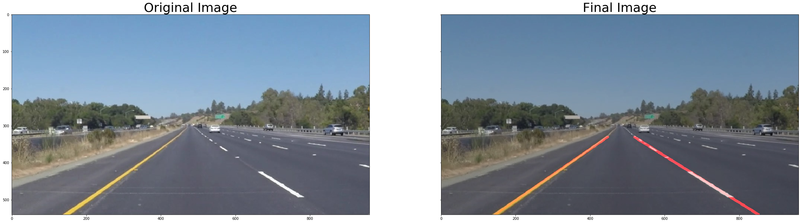

# **Finding Lane Lines on the Road**

### Reflection

### 1. The Process.

My pipeline consisted of several steps. I started by converting image to HSL for better color selection. I then applied mask on the image to extract white and yellow colors from the image since lanes in the given images were either white or yellow.
I then tranformed image into grayscale before reducing noise using Guassian Blur. After that I applied Canny Edge algorithm to detect lane edges from the image.
To filter out the edges from surroundings, I defind a polygon as region of interest that covered just about the lanes. I then applied Hough Transform algorithm to draw the lines.
I then modified the draw_lines() function to extrapolate line by finding average slope and intercept for all the lines per lane.

### 2. Identify potential shortcomings with your current pipeline

One potential shortcoming would be what happens when the light changes. It may effect the color selection process.
Another one can be affect of more sharp turns on the pipline

### 3. Suggest possible improvements to your pipeline

One way to improve the pipline is maybe by handling outliers better and taking care of tree shadows.
